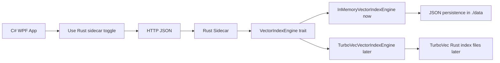

# Rust Sidecar Architecture

The Rust sidecar is a standalone HTTP JSON service that remains process-isolated from the WPF application. The WPF app can optionally call it for search/benchmark through the **Use Rust sidecar** toggle, while Python-sidecar ingest remains separate.

## Modules

- `config.rs` parses CLI arguments and matching environment variables.
- `routes.rs` owns the axum HTTP routes and translates JSON requests/responses.
- `models.rs` defines the stable camelCase JSON DTOs.
- `error.rs` maps application errors to JSON error responses and HTTP status codes.
- `state.rs` shares the selected vector engine with route handlers.
- `engine/mod.rs` defines the `VectorIndexEngine` trait.
- `engine/in_memory.rs` implements the fully functional thread-safe POC engine.
- `engine/turbovec.rs` provides a compile-safe TurboVec placeholder.
- `math/cosine.rs` implements safe cosine similarity.
- `persistence/json_store.rs` implements simple JSON save/load for POC persistence.

## Runtime flow

1. `main.rs` parses host, port, data directory, and engine options.
2. The default `in-memory` engine is created and wrapped in `Arc<dyn VectorIndexEngine>`.
3. axum serves the route table on `127.0.0.1:43187` by default.
4. Requests validate collection shape and vector dimensions before mutation or search.
5. Upsert replaces existing records with the same `id`.
6. Search computes cosine similarity, applies optional filters, sorts descending by score, and truncates to `topK`.
7. Save/load uses JSON files under the configured data directory.

## Engine replacement seam

The `VectorIndexEngine` trait is the replacement seam for a future TurboVec-backed implementation. Route handlers depend only on the trait and DTOs, so the public API can remain stable while the internal engine changes.
